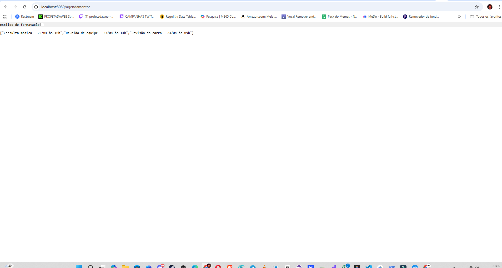
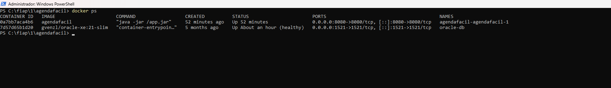
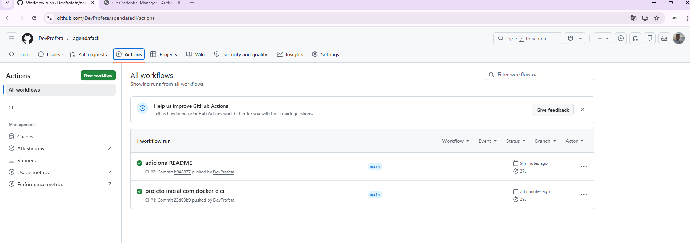

Repositório disponível em:
https://github.com/DevProfeta/agendafacil

## Projeto - Agendafacil

## 🎯 Objetivo do Projeto

Este projeto foi desenvolvido como parte de uma proposta acadêmica com foco em práticas de DevOps. A aplicação consiste em uma API REST simples para gerenciamento de agendamentos, podendo futuramente ser integrada com plataformas como WhatsApp e outros canais digitais.

---

## 📸 Evidências de Funcionamento

### API funcionando


### Docker em execução


### Pipeline CI/CD no GitHub


---

## 🛠 Tecnologias utilizadas

| Tecnologia | Versão |
|---|---|
| Java | 17 |
| Spring Boot | 3.2.5 |
| Maven | 3.9+ |
| Docker | 20+ |
| GitHub Actions | CI/CD |

---

## 🚀 Como executar localmente com Docker

### Build e execução

```bash
mvn clean package
docker build -t agendafacil .
docker run -p 8080:8080 agendafacil
